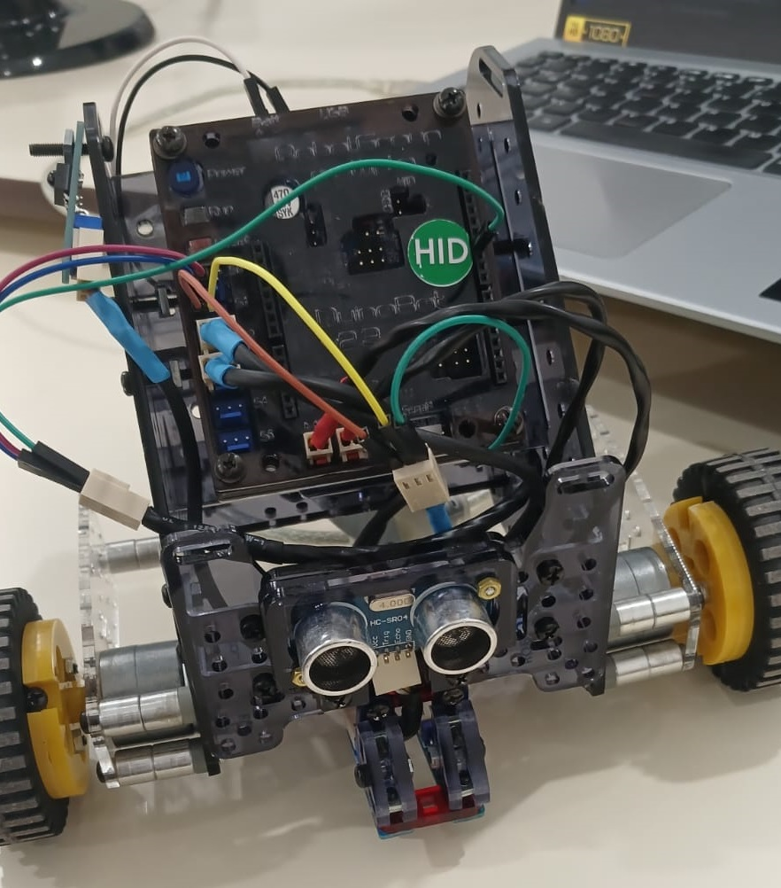
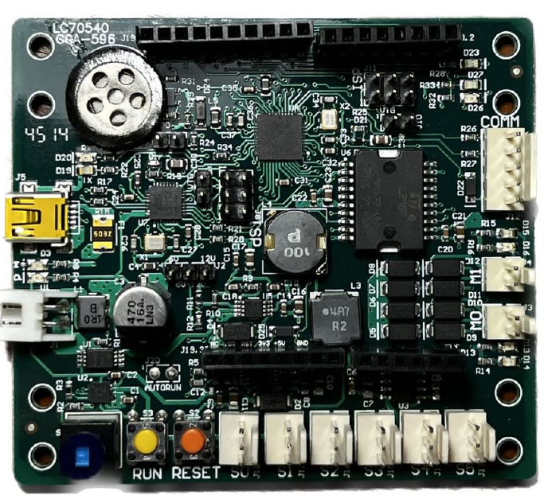

# Control de DuinoBot
Se hizo un algoritmo de control del robot _DuinoBot v2.3_ a partir de las librerías provistas por los alumnos de ingeniería electrónica de la UNLP

[Robot funcionando](video.mp4)

## Instalación
## Cómo compilar main.hex?
`make`, (para lo cual hay que tener instalado _make_)
## Cómo hacer el flashing de main.hex en el microcontrolador?
`make flash`
### Error: unable to open device
Este error es causado por problemas de administración. Hay que abrir la terminal como administrador, luego hay que ejecutar el siguiente comando para flashear: `make flash`

## Posibles mejoras
### Dependencias
Se intentó incluir todas las dependencias en el proyecto, para que no haya necesidad de tener que instalar cosas extras, pero igualmente hacen falta algunas.
- make (para poder compilar con el archivo Makefile)
- avr-gcc (compilador para que haya intellisense en vscode y para poder compilar el .hex que se va a flashear en el micro)
El resto de dependencias están contenidas dentro del proyecto.
### ¿Qué pasa si se cambia de microcontrolador?
Se deben hacer los cambios acordes en el archivo Makefile (MCU = atmega1284p).

### Algunos problemas que pueden ocurrir
- La primera vez quizás tengas que configurar donde se encuentra _avr-gcc.exe_ en vscode, hay que ir a `.vscode/c_cpp_properties.json` y cambiar `compilerPath` acordemente. También hay que configurar _avr-gcc.exe_ en Makefile a la ruta correcta.

## Contribuidores
- Tomás Vidal
- Bruno Benítez
- Jeronimo Gómez Tantarelli
- Ignacio Brittez
